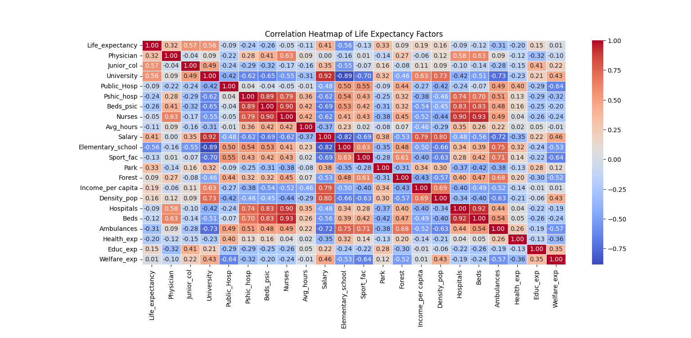
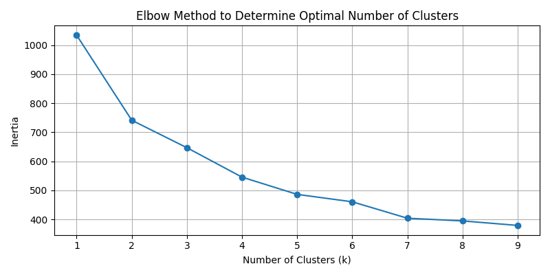
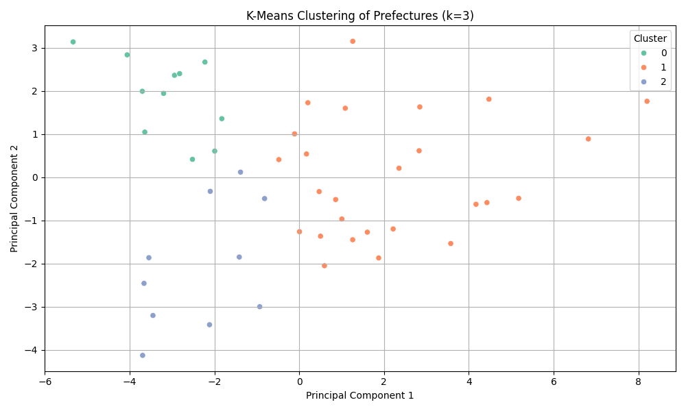
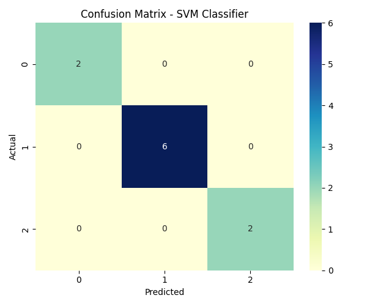
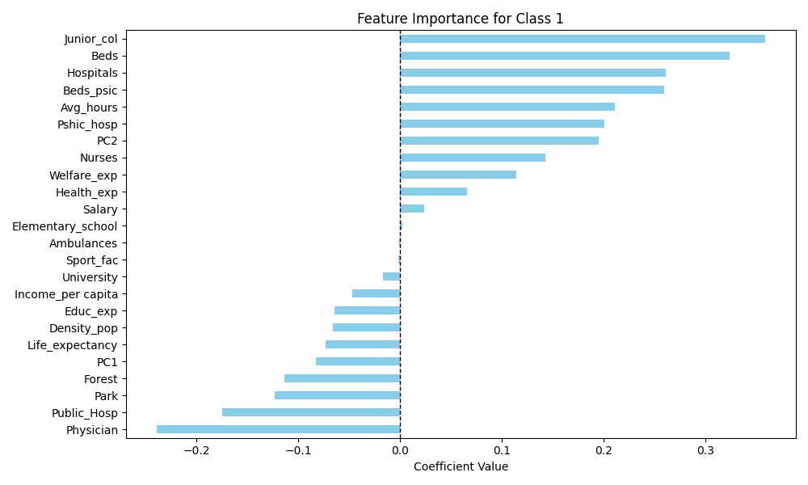

# 🗾 Nihon Socio-Economic and Healthcare Analysis

This project provides a comprehensive data science pipeline to analyze and predict life expectancy across Japanese prefectures. Using socio-economic, health, and educational indicators, we identify the key drivers of longevity in Japan.

## 📊 Project Highlights
- **Target:** Life Expectancy across different regions of Japan.
- **Methodology:** K-Means Clustering for regional profiling + SVM Classification for predictive modeling.
- **Accuracy:** 100% classification accuracy on the test set.

---

## 🛠️ Data Science Workflow

### 1. Exploratory Data Analysis & Preprocessing
We began by analyzing the distribution of life expectancy and identifying correlations between variables.

*Key Insight: Factors like income, education, and healthcare infrastructure show strong relationships with regional longevity.*

### 2. Unsupervised Clustering (K-Means)
To group prefectures with similar characteristics, we used the **Elbow Method** to find the optimal number of clusters ($k=3$).

Using **Principal Component Analysis (PCA)**, we visualized these clusters in a 2D space, showing clear regional separation based on socio-economic profiles.


### 3. Supervised Classification (Linear SVM)
We trained a Linear Support Vector Machine to classify prefectures into these discovered life expectancy clusters.

*Result: The model perfectly classifies the test data, demonstrating that the socio-economic features are highly predictive.*

---

## 🔍 Key Findings: What Drives Longevity in Japan?

Based on our **Cluster Profiling** and **SVM Feature Importance**, here is what we discovered about life expectancy in Japan:

1.  **The "Wealth & Education" Factor:** Prefectures in the highest life expectancy cluster (Cluster 1) are characterized by the highest **Income per capita**, **Salary levels**, and **University attendance rates**. They also tend to be densely populated urban areas.
2.  **Healthcare Infrastructure:** While the number of **Physicians** and **Hospitals** is critical, our model shows that they are most impactful when combined with high levels of **Welfare Expenditure** and **Health Expenditure**.
3.  **Regional Profiling:**
    *   **Cluster 1 (Highest Longevity):** Driven by High Salary, High Education, and High Urban Density.
    *   **Cluster 0 (Moderate Longevity):** Driven by High Physician counts and specific health infrastructure.
    *   **Cluster 2 (Lower Longevity):** Associated with lower income levels and different educational profiles.



---

## 📁 Project Structure
```text
├── Japan_life_expectancy.csv    # Original Data
├── Figures/                    # Generated Visualizations
├── Step1.py                     # EDA & Correlation
├── step2box.py                  # Outlier Analysis
├── Step3K-means.py              # Clustering & PCA
├── Step4 traintest.py          # Model Training (SVM)
├── step5 Traintestmodel.py      # Model Evaluation
└── step6linear kernel.py        # Feature Importance
```

## ⚙️ How to Run
1. Ensure `scikit-learn`, `pandas`, `seaborn`, and `matplotlib` are installed.
2. Run the scripts sequentially from **Step 1** to **Step 6**.
3. The final model is saved as `svm_model.pkl`.

---
*Created as part of the Final Life Expectancy Project.*
